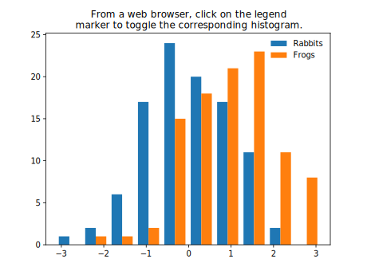

# glowing-giggle

#work in progress

<svg width="300" height="200">
    <rect width="100%" height="100%" fill="green" />
</svg>

Mouseover the rect to see the tooltip on supporting browsers.

<object data="svg_histogram.svg"
    width="300"
    height="250"
    type="image/svg+xml">

